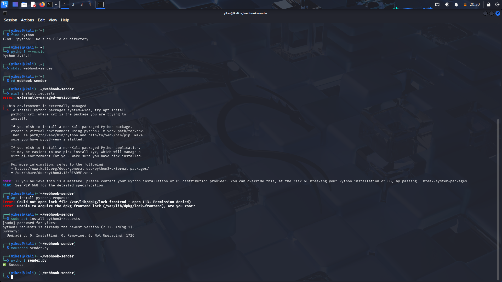
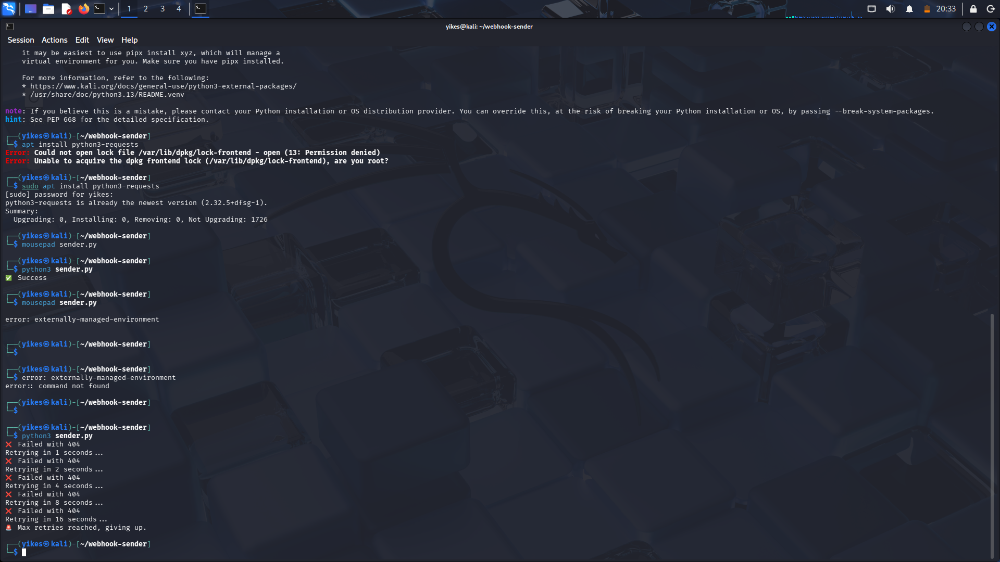
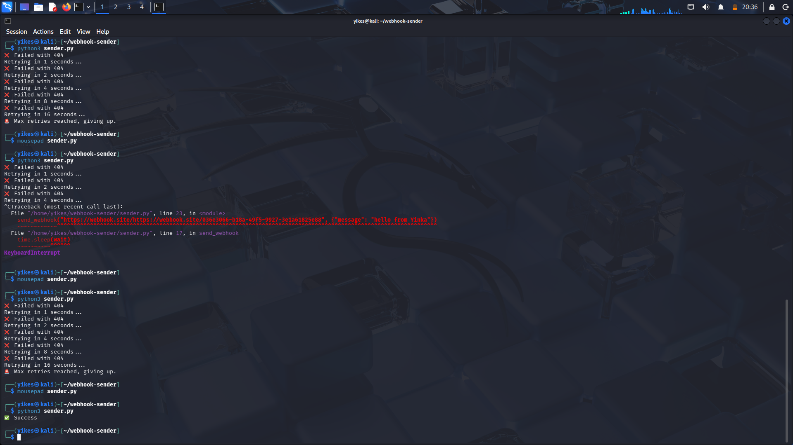

# webhook-sender

# Webhook Sender with Retry Queue

A Python project that sends webhooks with automatic retries using exponential backoff.

## Features
- Sends HTTP POST requests
- Retries failed requests up to 5 times
- Exponential backoff (1s, 2s, 4s, 8s...)
- Easy to extend with a queue system





## How to Run
```bash
pip install requests
python sender.py

